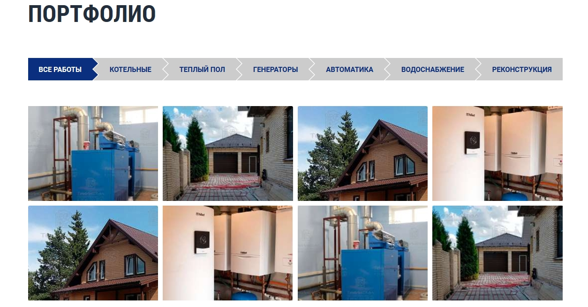

# TechInstal
Ссылка: https://alexaltrex.github.io/TechInstal

## Описание
Верстка сайта магазина. 

## Запуск проекта:
1. Клонирование и запуск: git clone https://github.com/Alexaltrex/TechInstal.git;
2. Переход в директорию с проектом: cd TechInstal;
3. Запуск файла index.html;

## Цель проекта
* Изучение верстки и стилизации;
* Изучение jQuery, в частности анимации;
* Изучение программирования jQuery в рамках верстки

## Разработка
* Код - jQuery v.3.4.1;
* Верстка - предпроцессор SASS (конкретно SCSS);
* Адаптивный дизайн, поддержка мобильной версии;
* Слайдер slick
* Анимированный калькулятор

